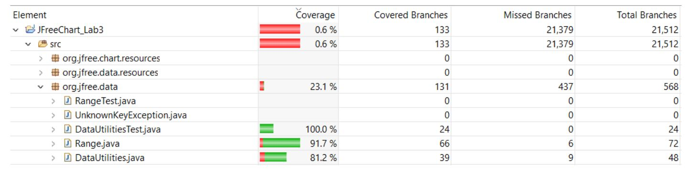

**SENG 438 - Software Testing, Reliability, and Quality**

**Lab. Report #3 – Code Coverage, Adequacy Criteria and Test Case Correlation**

| Group \#:      |  10   |
| -------------- | --- |
| Student Names: | Redwanul Islam    |
|                | Mohammad Mahtab Khan    |
|                | Rahat Islam    |
|                | Zeeshan Chougle    |

# 1 Introduction

The purpose of this lab is to explore automated unit-testing and more specifically, the concept of white-box testing. Functions from the DataUtilities and Range classes are tested using a combination of unit tests and mock tests. This was accomplished by utilizing Java’s JUnit framework to develop these unit tests. In this lab, we also wanted to include as much statement coverage, decision coverage and method coverage as possible.

# 2 Manual data-flow coverage calculations for X and Y methods

## DataUtilities.calculateColumnTotal

# 3 A detailed description of the testing strategy for the new unit test

During the black box testing phase, our group was focused on testing methods using by discovering the boundary and equivalence classes. To build on top of our black-box tests, we wanted to make sure we had statement, decision and method coverage. To get the desired coverage needed in this assignment, our goal was to create different test cases that would run the different statements from different branch conditions. The Eclemma tool was very beneficial in giving us a graphical view of what statements were covered fully, partially or not at all.

# 4 A high level description of five selected test cases you have designed using coverage information, and how they have increased code coverage

**public void testCombineRangeIgNaN1():**

For this test case, we created the first range to be null and the second range to be NaN such that the return null statement would occur. The result was increased statement and branch coverage.
  
**public void testCombineRangeIgNaN3():**

For this case, the first range was set to null and the second range was given valid parameters. This allowed the return range2 statement to get called.

**public void testExpand1():**

In this test case we had a range of (0,1) and expanded both the upper and lower margin by a factor of 1. As a result, all statements were covered under the if statement, as the statement returned false.
  
**public void testExpand2():**

To get complete coverage of the branches and statements from the above example, we used a range of (0,1) but used a lower margin of -1 and an upper margin of 0. As a result, the if block returned true and combined the two methods received total statement and decision coverage.
  
**public void testHashCode():**

The HashCode method has no branches so all we had to do was write one test to get full coverage. We had a range from (0,1) and the correct hashcode was received.

# 5 A detailed report of the coverage achieved of each class and method (a screen shot from the code cover results in green and red color would suffice)

**Statement Coverage**

**Branch Coverage**

**Method Coverage**

# 6 Pros and Cons of coverage tools used and Metrics you report

Our group decided to use only one coverage tool. The tool we used is known as EclEmma and it is native to Eclipse IDE 2021. We decided to use three different coverage metrics. The coverage metrics used are, statement, branch and method coverage. We decided to use method coverage instead of condition coverage as we used EclEmma exclusively and was suggested to do so by the lab document.

| Metrics        |        Pros      |      Cons      |
| -------------- | ---------------- | -------------- |
| Statement Coverage | It measures the quality of code written    |  Logical operators are not understood |
| Branch Coverage              | Allows to validate all branches in the code    | Branches inside boolean expressions are ignored |
| Method Coverage               |  It allows us to see if all methods are tested    | Does not check if all the methods have been tested fully |

# 7 A comparison on the advantages and disadvantages of requirements-based test generation and coverage-based test generation.

**Requirements-based testing advantages:**
In Waterfall, requirements-based testing has the advantage of being well-defined and time-boxed, which makes testing easier to plan. Developers can use their knowledge of the number of requirements that will define the test suite to more accurately estimate how long it will take to test the software. In the same way, it's easier to design tests when developers know about the explicitly defined requirements from the early stages of a Waterfall project. So, if testers map tests back to a project's requirements, they can conceivably measure test coverage.
 
 
**Requirements-based testing disadvantages:**
Requirements-based testing, however, can easily miss important parts of software quality. For instance, requirements can be too brief and may have trouble capturing important elements of software design.

**Coverage-based testing advantages:**
Code coverage creates additional test cases to increase coverage. It helps in finding areas of a program not exercised by a set of test cases. It also helps in determining a quantitative measure of code coverage, which indirectly measures the quality of the application or product.
Coverage-based testing disadvantages:
One of the drawbacks of code coverage based testing is that it measures coverage of what has been written, i.e the code itself. It cannot say anything about the software that has not been written. You may not be able to compare code coverage results of one tool to another as the methodology used by tools could be different.

# 8 A discussion on how the team work/effort was divided and managed

We split the test cases amongst the 4 members for 2 of the classes to be tested (Range and DataUtilities). We each worked on developing tests for at least 3 methods to ensure we meet the required coverage criteria. We then checked each other's tests and reviewed them before compiling them together. The report sections were divided between the 4 of us.

# 9 Any difficulties encountered, challenges overcome, and lessons learned from performing the lab

The initial setup for the project took some time, as there were many external jars and instructions that had to be followed before anything would work. Getting familiar with the EclEmma tool also took a while. However, once everything was setup and the tools were familiarized, our team was able to get the work done swiftly.

# 10 Comments/feedback on the lab itself

The lab was very exciting and a great learning experience for everyone. It was cool to see how external tools and IDEs can vastly assist in the testing process for coverage.
